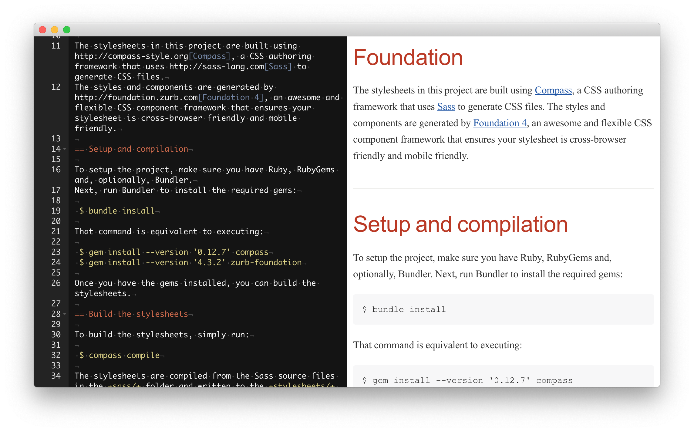

# Asciitron

Asciitron is a simple [Asciidoc(tor)](https://asciidoctor.org) Editor built with [Electron](https://electronjs.org) and [Asciidoctor.js](https://asciidoctor.org/docs/asciidoctor.js/).




## Prerequisites

- Git (https://git-scm.com)
- NPM (https://www.npmjs.com)


## How to use

```bash
# Clone this repository
git clone https://github.com/tbreuss/asciitron.git

# Go into the repository
cd asciitron

# Install dependencies
npm install

# Run the app
npm start
```

## Other NPM scripts

```bash
# Pack repository
npm pack

# Build project
npm build

# Package MAC
npm package-mac

# Package Win
npm package-win

# Package Linux
npm package-linux
```

## License 

[CC0 1.0 (Public Domain)](LICENSE.md)


## Suggestions

Any suggestions? Open an issue.
